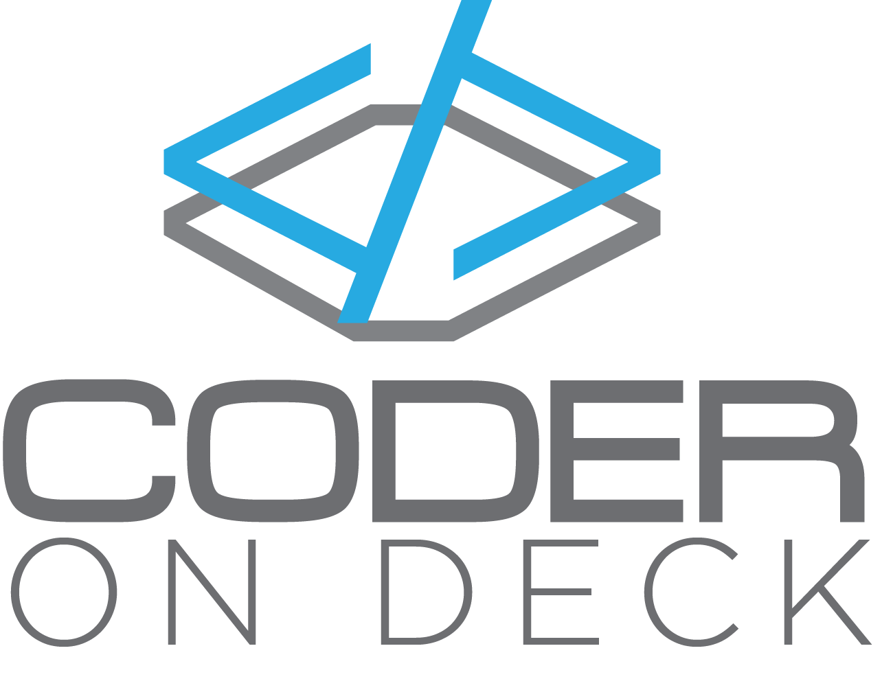

# coder-on-deck

Code On Deck is about writing code.   
Be it for fun, challenge or anything, writing code is fun.   
We blog and buzz about what we do. 

Ideas: 

 - [ ] Awesome list website where people can vote up/down. 
   - You can use reverse-dl to spread updates
 - [ ] A completely anonymous publishing website. No identifying details needed to publish.
 - [ ] Cheat sheet based on markdown
   - With a chrome extension. Give it a link and it will render a markdown.
   
 
 
List of all repositories: 
 - [ptor-xunit-grep](https://github.com/coder-on-deck/ptor-xunit-grep-builder).
 - [killable-static-server](https://github.com/coder-on-deck/killable-static-server)
 - [generate-index-html](https://github.com/coder-on-deck/generate-index-html)
 - [protractor-get-element-screenshot](https://github.com/coder-on-deck/protractor-get-element-screenshot)
 - [imagedir-diff](https://github.com/coder-on-deck/imagedir-diff)
 - [turbo-pancake](https://github.com/coder-on-deck/turbo-pancake)
 - [graphicss](https://github.com/coder-on-deck/graphicss)
 - [configus](https://github.com/coder-on-deck/configush)
 - [mavenmon](https://github.com/coder-on-deck/mavenmon)
 - [reverse-dl](https://github.com/coder-on-deck/reverse-dl)
 - [nodejs-easy-setup](https://github.com/coder-on-deck/nodejs-easy-setup)
 - [animated-parakeet](https://github.com/coder-on-deck/animated-parakeet)
 - [typescript-easy-setup](https://github.com/coder-on-deck/typescript-easy-setup)
 - [jenkins-monitor-job-chrome-extension](https://github.com/coder-on-deck/jenkins-monitor-job-chrome-extension)
 - [chrome-extension-angular](https://github.com/coder-on-deck/chrome-extension-angular)
 - [classes-metadata-mojo](https://github.com/coder-on-deck/classes-metadata-mojo)
 - [mailjet-send-cli](https://github.com/coder-on-deck/mailjet-send-cli)
 - [maildrop-client](https://github.com/coder-on-deck/maildrop-client)
 - [sturdy-octo-broccoli](https://github.com/coder-on-deck/sturdy-octo-broccoli)
 - [npm-ng-annotate](https://github.com/coder-on-deck/npm-ng-annotate)

